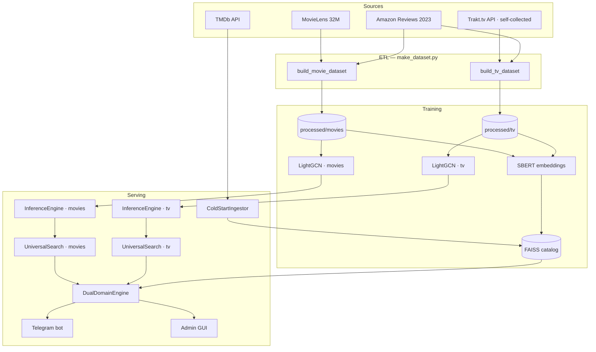

# Architecture

This document describes how the recommender is put together: the data flow, the
two graph models, how recommendations and search are produced, and how the pieces
are served. For a quick overview see the [README](README.md); for setup of data
sources see [docs/data_sources.md](docs/data_sources.md).

---

## Design philosophy: two models, one bridge

Movies and TV are **different recommendation problems**. The movie graph is dense
(MovieLens gives tens of millions of ratings); the TV graph is sparser and was
collected separately. Their popularity distributions, genre vocabularies, and
co-watch structure differ. Training a single model over both blurs the signal.

So the system uses **two independent LightGCN models**, each with its own
user/item embedding space, and bridges them with a **shared FAISS index over
multilingual text embeddings**. The graph models answer "people like you also
liked…" *within* a domain; the FAISS bridge answers "this is *similar in content*
to what you liked" *across* domains and for brand-new items not yet in any graph.



---

## 1. Data layer (ETL)

`make_dataset.py` has two independent builders, `build_movie_dataset()` and
`build_tv_dataset()`, driven by a `--domain {movies,tv,all}` CLI. Each domain
gets its **own** sequential `item_id` / `user_id` space for tensor operations,
while `tmdb_id` stays the **global** key shared across domains and FAISS.

- **Movies:** MovieLens 32M is the backbone; `links.csv` maps MovieID → TMDB ID.
  Optional TMDB metadata enriches overview/keywords/popularity. Optional Amazon
  Reviews adds interactions, title-matched onto the MovieLens id space.
- **TV:** the Trakt.tv signal (self-collected via `trakt_collector.py` — a
  multi-phase, checkpointed, rate-limited crawl that produced ~5K shows × ~83K
  users × ~1.95M ratings). TV ids carry a `TV_OFFSET = 10,000,000` so a TV
  `tmdb_id` never collides with a movie one in the shared FAISS catalog / hot cache.

Output per domain: `interactions_final.parquet`, `items_metadata_final.parquet`,
`id_mapping.json`. See [docs/data_sources.md](docs/data_sources.md) for schemas.

---

## 2. The graph model: LightGCN

Each domain's interactions form a **bipartite user–item graph**: an edge connects
a user to an item they rated positively. LightGCN learns a vector (embedding) for
every user and item such that connected nodes end up close together.

**Why "Light":** classic graph neural networks transform features with a weight
matrix and a non-linearity at every layer. LightGCN drops both — for collaborative
filtering they mostly add noise. A layer is just **neighborhood averaging** with
symmetric normalization:

```
e_i^(k+1) = Σ_{j∈N(i)}  1/√(|N(i)|·|N(j)|)  · e_j^(k)
```

i.e. a node's next-layer vector is the degree-normalized sum of its neighbors'
current vectors (`LightGCNConv` in `lightgcn.py`). Stacking `K` layers lets signal
propagate `K` hops (user → item → other users → their items …). The final
embedding is a weighted sum of all layers (layer 0…K), with **learnable softmax
weights** so the model decides how much each hop contributes.

**Hybrid embeddings (v2).** Item vectors start from a learned ID embedding plus a
small projection of content features (genres, year): `id + 0.5·genre + 0.2·year`.
This gives cold-ish items a sensible starting point and adds diversity. Training
deliberately avoids BatchNorm and over-normalization to prevent *embedding
collapse* (all vectors converging to one point), uses Xavier init with `gain=1.5`,
and applies edge dropout (0.2).

**Losses.** A combination of:
- **BPR** (Bayesian Personalized Ranking) — for each (user, liked item) pair and a
  sampled negative, push the positive score above the negative. This drives *ranking*.
- **InfoNCE** (contrastive, temperature 0.1) — treat all other items in the batch
  as negatives, spreading embeddings apart. This drives *separation* and fights collapse.

Training is via `trainer.py` (CLI) or the GUI Tab 1, locally or on any GPU host.
See [docs/trainer_gui_guide.md](docs/trainer_gui_guide.md).

---

## 3. Inference: from likes to a ranked list

`InferenceEngine` (per domain) loads a checkpoint and serves recommendations:

1. **User vector** — the user isn't in the trained graph at request time, so their
   taste is approximated as the **mean of the embeddings of the items they liked**.
2. **Scoring** — cosine similarity between the (normalized) user vector and every
   item embedding. Liked items are masked out (`-inf`).
3. **Popularity de-bias** *(movies only, λ = 0.5)* — subtract a normalized
   `log1p(vote_count)` penalty from each score. Globally-popular blockbusters sit
   near every user vector in the co-watch graph, so without this they dominate
   every list ("the IMDb top-250 for everyone"). The penalty makes the list reflect
   *"popular among users like you"* instead. TV runs with λ = 0 (small catalog, no
   collapse). This is a deliberate trade-off — see
   [Quality & testing](#5-quality--testing).
4. **Sequel filter** — drop a candidate whose first significant title token appears
   in a liked title (so "Iron Man" doesn't just return "Iron Man 2").
5. **Intent clustering** *(in `UniversalSearchEngine`)* — when a user has several
   likes, agglomerative clustering on their embeddings splits them into sub-intents
   (e.g. "gritty action" vs "superhero"), and each cluster gets a proportional quota
   of the final list. This keeps a multi-taste user from getting a list dominated by
   one cluster.

---

## 4. Non-graph search

Search (typing a title into the bot/GUI) is **independent of the graph** — it has
to find a specific title, not recommend similar ones. `UniversalSearchEngine.search`
layers three signals:

- **Local lookup** over the processed metadata, matching `title`, `title_ru`,
  `title_uk` in parallel, so "Lord of the Rings" / "Властелин колец" / "Володар
  Перснів" all resolve to the same film. A **title normalizer** folds numeric
  variants (`Se7en` ↔ `seven`, `M3GAN` ↔ `megan`) and Cyrillic queries.
- **Hot cache** (SQLite) of previously-seen live results.
- **TMDb live fallback** — only when local results are thin *and* an API key is
  configured. Live results are scored by a fusion of title relevance, semantic
  similarity (SBERT), keyword/genre IDF overlap, recency and quality, minus a
  popularity floor that filters obscure fuzzy noise. A strong (exact/prefix) title
  match bypasses that floor, so cult low-popularity titles still surface.

Content recommendations (the FAISS bridge below) and search both use the same
**SBERT model** (`paraphrase-multilingual-MiniLM-L12-v2`), which embeds RU/UK/EN
into one vector space.

---

## 5. FAISS content-bridge & cold-start

`faiss_bridge.py` holds a single `IndexIDMap2(IndexFlatIP)` over **L2-normalized**
SBERT vectors (so inner product = cosine), shared by both domains. A JSON sidecar
maps `faiss_id → (tmdb_id, media_type)`.

- **Cross-domain** (`recs_cross`) — embed the liked item's text, query FAISS,
  return nearest neighbors of the *opposite* media type. This is how "you liked
  this show → here's a film" works without a single joint graph.
- **Cold-start** (`cold_start.py`) — an unknown title is fetched from TMDb, cached
  in SQLite, SBERT-encoded, and upserted into FAISS. The ingestor is idempotent
  (checks FAISS before calling TMDb), so repeat requests are instant.

---

## 6. Routing & serving

`DualDomainEngine` is the front door over the two `UniversalSearchEngine`
instances plus the FAISS catalog:

- `recs_movie()` / `recs_tv()` — within-domain, via that domain's LightGCN.
- `recs_cross()` — pure FAISS bridge to the opposite media type.
- `recs_all()` — union of both, with min-max score normalization.
- `_split_by_domain()` — routes a mixed like-list by the `TV_OFFSET` convention.

Two front-ends consume it with **identical** semantics:
- **`movie_bot.py`** — an Aiogram Telegram bot (trilingual RU/UK/EN, SQLite session
  store for likes and language prefs, heavy work offloaded via `asyncio.to_thread`).
- **`gui/`** — a Flet desktop admin GUI for dataset building, local training, and
  offline recommendation testing.

Because both call the same engine, a result that differs between bot and GUI points
to a bug in the front-end, not the recommender.

---

## ID system (one global key, two local spaces)

| Id | Scope | Used for |
|---|---|---|
| `tmdb_id` | **global** | the canonical key across both domains, FAISS, TMDb, the bot |
| `item_id` | **per-domain** | sequential index into the embedding tensors |
| `TV_OFFSET = 10,000,000` | TV `tmdb_id` | keeps TV ids from colliding with movie ids in the shared FAISS catalog / hot cache |

Per-domain mapping lives in `data/processed/{movies,tv}/id_mapping.json`.

---

## Quality & testing

Beyond unit tests, the suite has **behavioral quality gates** that run the real
models on curated scenarios (genre fidelity, popularity de-bias, graph overlap,
search quality). Some gates encode deliberate, documented trade-offs as `xfail` —
e.g. the popularity de-bias intentionally suppresses globally-popular franchise
sequels, which conflicts with a "must-recommend popular MCU films" gate. These
tensions, and the de-bias calibration, are the kind of trade-off this architecture
makes explicit rather than hides. Tests skip cleanly when model/data artifacts are
absent, so a fresh checkout stays green.

---

## See also

- [README.md](README.md) — project overview and getting started.
- [docs/data_sources.md](docs/data_sources.md) — data setup & schemas.
- [docs/trainer_gui_guide.md](docs/trainer_gui_guide.md) — the admin GUI.
- `spec/two-model-architecture.md` — the original design rationale (internal).
