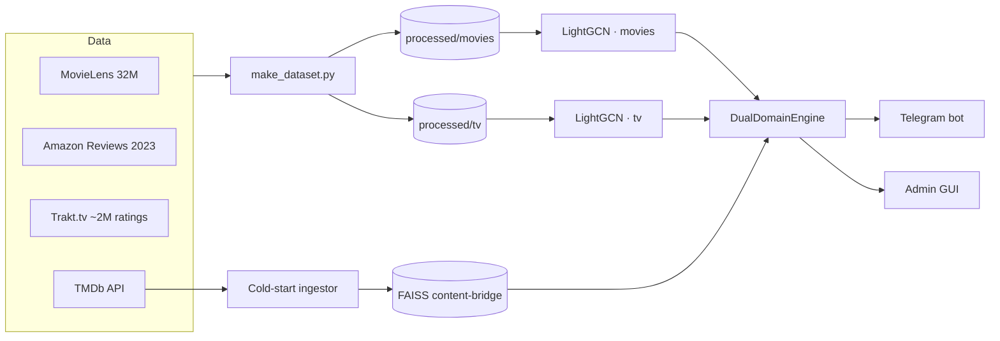

# Film & TV Recommendation System

A real-time, **dual-domain** recommender for movies and TV shows built on
**LightGCN** graph neural networks, with a **FAISS** content-bridge for
cross-domain suggestions and cold-start, served through a trilingual
(RU / UK / EN) **Telegram bot**.

> **Status:** v0.9 — two-model architecture in production; local training (CLI +
> desktop GUI) implemented. Trained on ~2M real interactions.

---

## Quick start

Trained models, processed datasets, and the FAISS catalog live **outside git** —
pick the option that matches what you have.

### Option A — run with prebuilt artifacts (~2 minutes)

If you received the artifacts archive from the author, no build is needed:

```bash
git clone <this repo> && cd recommendation_for_film_and_tv_shows
pip install -e .        # or: uv sync — also installs the recsys-* commands below

# unpack the artifacts archive into the repo root; it provides:
#   data/processed/{movies,tv}/   models/{movies,tv}/   src/recommendation_system/faiss_index/

recsys-gui              # desktop GUI — needs no tokens
```

To run the **Telegram bot** instead, first create `.env` in the repo root:

```bash
TMDB_API_KEY=...          # themoviedb.org → API settings (cold-start, translations)
TELEGRAM_BOT_TOKEN=...    # your own bot token from @BotFather
```

```bash
recsys-bot
```

### Option B — build everything from scratch

```bash
pip install -e .        # or: uv sync — also installs the recsys-* commands

# 1. Raw data → data/raw/
#    movies: MovieLens 32M — https://grouplens.org/datasets/movielens/32m/
#    tv:     trakt_shows.csv + trakt_interactions.csv → data/raw/
#            prebuilt download: github releases tag data-v1 (see docs/data_sources.md)

# 2. Build the datasets (minutes)
recsys-dataset --domain all
#    optional: also fold in Amazon Reviews 2023 (see docs/data_sources.md)
#    recsys-dataset --domain all --amazon-dir data/raw/amazon

# 3. Train both models (tv trains anywhere; the movies graph is large —
#    use a big-memory GPU or Colab, see docs/setup_from_scratch.md)
recsys-train --domain movies --epochs 30
recsys-train --domain tv     --epochs 30

# 4. Embeddings + FAISS catalog (minutes; downloads SBERT once)
recsys-embed --domain all --to-faiss

# 5. Run — GUI needs no tokens; the bot needs .env (see Option A)
recsys-gui
recsys-bot
```

What each step does and produces — **[docs/setup_from_scratch.md](docs/setup_from_scratch.md)**.
The admin GUI is documented in **[docs/trainer_gui_guide.md](docs/trainer_gui_guide.md)**.

> Python ≥ 3.10 (developed on 3.13). The `recsys-*` commands are installed into the
> active environment by `pip install -e .`; the long form
> `python -m recommendation_system.…` works identically (PyCharm: use module-mode
> run configurations, not script paths).
>
> **GPU note:** `pip install -e .` installs the **CPU** torch build, which is enough
> to serve the bot and GUI. For GPU **training**, install the CUDA build matching
> your toolkit instead, e.g.
> `uv pip install torch==2.6.0+cu124 --index https://download.pytorch.org/whl/cu124`.

---

## Core idea

Two **independent LightGCN models** — one for movies, one for TV — each with its
own user/item embedding space. Keeping the domains separate preserves signal
quality inside each (a movie graph and a TV graph have very different structure),
while a shared **FAISS index over multilingual text embeddings** bridges them for
cross-domain recommendations ("you liked this show → here's a film") and
cold-start items that aren't in either graph yet.



See **[ARCHITECTURE.md](ARCHITECTURE.md)** for the full design and data flow.

---

## Features

- **Graph-based recommendations** — LightGCN (PyTorch Geometric) learns
  collaborative signal from a bipartite user–item graph per domain.
- **Cross-domain bridge** — FAISS `IndexFlatIP` over normalized SBERT
  (`paraphrase-multilingual-MiniLM-L12-v2`) embeddings links movies ↔ TV.
- **Cold-start** — unknown titles are fetched live from TMDb, cached in SQLite,
  encoded, and upserted into the FAISS catalog on the fly.
- **Hybrid search** — semantic (SBERT) + keyword/genre (IDF) + title
  normalization (e.g. `Se7en` ↔ `seven`, Cyrillic queries), independent of the graph.
- **Popularity de-bias** — a tunable penalty keeps the movie list from
  collapsing into the global IMDb top-250 (reflects "popular among users like
  you", not "popular overall"). Toggleable per user: `/debias` in the bot, a
  switch in the admin GUI.
- **Trilingual** — RU / UK / EN interface and per-user language preference.
- **Two ways to drive it** — an Aiogram Telegram bot for end users, and a Flet
  desktop admin GUI for dataset building, local training, and offline testing.

---

## Tech stack

| Layer | Tech |
|---|---|
| Models | PyTorch, PyTorch Geometric — two LightGCN (hybrid ID + content embeddings) |
| Content-bridge | FAISS `IndexIDMap2(IndexFlatIP)` on multilingual SBERT vectors |
| Data | MovieLens 32M · Amazon Reviews 2023 · Trakt.tv API · TMDb API |
| Search | SBERT (semantic) + IDF (keywords/genres) + title normalizer |
| Bot | Aiogram (Telegram) + SQLite session store |
| Admin GUI | Flet (desktop) |

---

## Repository structure

```
src/recommendation_system/
├── data/                 # ETL: MovieLens / Amazon / Trakt → processed parquet
│   ├── make_dataset.py   #   per-domain dataset builders (--domain movies|tv|all)
│   └── trakt_collector.py#   multi-phase Trakt.tv scraper (checkpoint + rate-limit)
├── models/gnn/           # the recommendation engine
│   ├── lightgcn.py       #   LightGCN model (graph conv, BPR + InfoNCE losses)
│   ├── trainer.py        #   training CLI (--domain, --epochs, …)
│   ├── inference_engine.py#  per-domain inference + popularity de-bias
│   ├── universal_search.py# hybrid search, intent clustering, media-DNA, hot cache
│   ├── dual_domain_engine.py# router over both models + FAISS bridge
│   ├── faiss_bridge.py   #   FAISS catalog (add / search / persist)
│   ├── cold_start.py     #   TMDb → cache → SBERT → FAISS ingestion
│   ├── compute_embeddings.py # SBERT embedding + FAISS build CLI
│   ├── movie_bot.py      #   Telegram bot (Aiogram)
│   ├── bot/              #   bot helpers (i18n, session store, search, keyboards)
│   └── gui/              #   Flet admin GUI (training / dataset / inference / data tabs)
├── data/ (processed)     # generated parquet + id mappings (git-ignored)
└── ...
tests/                    # pytest suite (unit + behavioral quality gates)
docs/                     # data_sources.md, trainer_gui_guide.md, …
```

---

## Testing

```bash
pytest -q
```

The suite mixes plain unit tests with **behavioral quality gates** that run the
real models on curated scenarios (genre fidelity, popularity de-bias, graph
overlap, search quality). Tests that need model/parquet artifacts **skip
cleanly** when those are absent, so a fresh checkout stays green.

---

## Data at a glance

- **MovieLens 32M** — dense movie collaborative signal.
- **Amazon Reviews 2023** ("Movies and TV") — extra interactions, title-matched.
- **Trakt.tv** — purpose-collected TV signal: **5,020 shows × ~83k users ×
  ~1.95M ratings** (fixes the historical 99% movie / 1% TV imbalance).
- **TMDb** — metadata, posters, translations, and live cold-start.

---

## Roadmap

- [x] Dual-domain LightGCN + FAISS content-bridge
- [x] Trilingual Telegram bot + Flet admin GUI
- [x] Local training (CLI + GUI)
- [x] Popularity de-bias for the movie ranker
- [ ] Periodic retrain pipeline (`scripts/retrain.py`, see `spec/retrain-pipeline.md`)
- [ ] Taste-relative de-bias (penalize popularity relative to user profile)
- [ ] Automated raw-dataset download scripts (MovieLens / TMDB)

---

## License

See [LICENSE](LICENSE).
