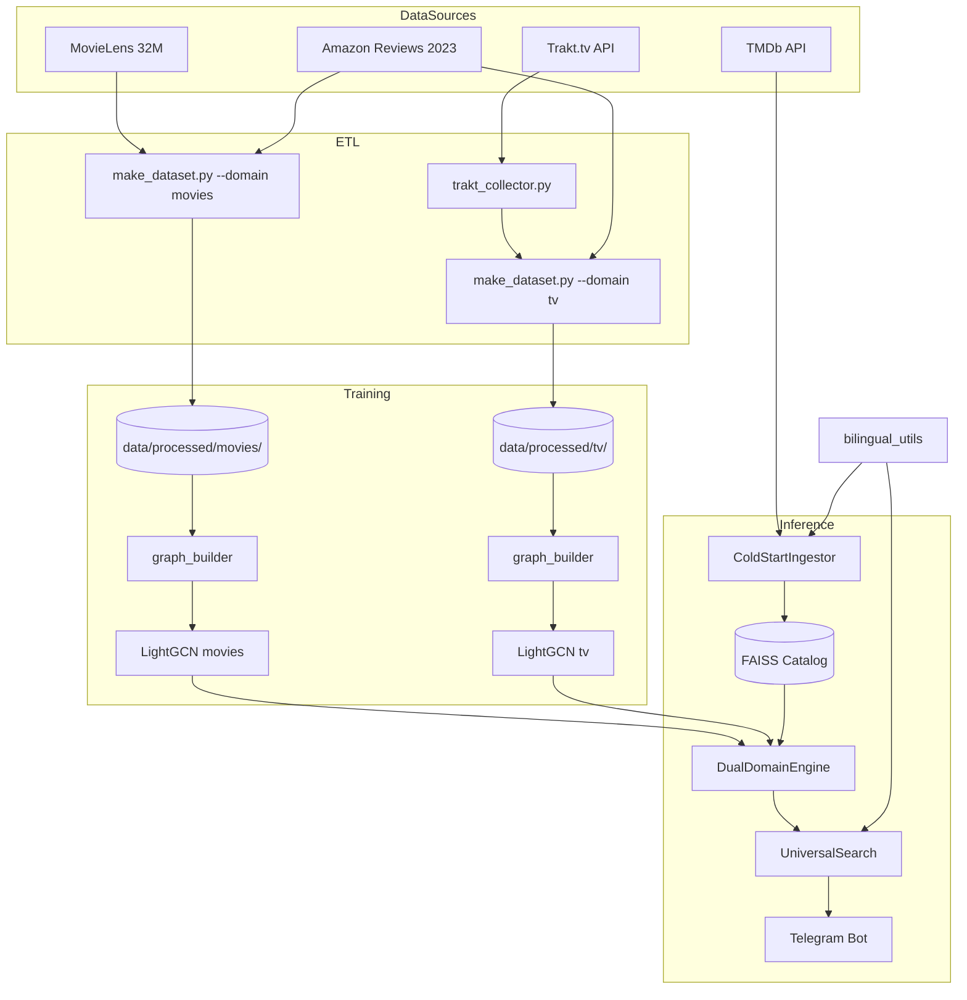

# PROJECT_SNAPSHOT: Dual-LightGCN Movie/TV Recommender

> **Timestamp:** 2026-06-03
> **Status:** Two-model architecture shipped (Stages 1–6 of `spec/two-model-architecture.md`); local training implemented — `trainer.py` CLI + admin GUI `trainer_gui.py` (refactored into the `gui/` subpackage, see 3.7). Popularity de-bias added for the movies ranker (active in bot, tests, and now the GUI via a toggle); quality gates resolved; public docs (README/ARCHITECTURE/docs) are in English, with a from-scratch setup guide (`docs/setup_from_scratch.md`). Stage 7 (retrain) — in progress (`spec/retrain-pipeline.md`).
> **Version:** 0.9.0

---

## 1. Vision & Core Concept

**System type:** a hybrid, real-time dual-domain recommender with a trilingual interface (RU/UK/EN).

**Core idea:** two independent LightGCN models (movies and TV), each with its own user/item space, joined by a FAISS content-bridge over text embeddings. This preserves signal quality inside each domain while still enabling cross-domain recommendations without blurring the signal.

### Tech stack
- **Core:** PyTorch, PyTorch Geometric (PyG)
- **Models:** two LightGCN v2 (Hybrid: ID + Content Embeddings) — `models/movies/`, `models/tv/`
- **Content-bridge:** FAISS `IndexFlatIP` over normalized SBERT vectors (`paraphrase-multilingual-MiniLM-L12-v2`)
- **Cold-start:** TMDb API + persistent SQLite HotCache + upsert into FAISS
- **Data:** MovieLens 32M + Amazon Reviews 2023 + Trakt.tv API + TMDb API
- **Search:** SBERT (semantic) + IDF (keywords/genres) + Title Normalizer
- **Interface:** Aiogram (Telegram bot) with a SQLite session store

---

## 2. Architecture (high-level)

---

## 3. Module structure

### 3.1 Data Layer (ETL & Graph)
- **`make_dataset.py`** — two independent builders: `build_movie_dataset()` and `build_tv_dataset()`. CLI `--domain {movies,tv,all}`. Each domain has its own user/item ID space; `tmdb_id` stays the global key; TV uses `TV_OFFSET=10_000_000`.
- **`trakt_collector.py`** — multi-phase collector with a SQLite checkpoint and a token-bucket rate limiter (RATE_LIMIT_MAX=950 req/5min). Resumable via `--reset-phase`.
- **`graph_builder.py`** — `MovieGraphBuilder(dataset_dir=...)` builds a sparse bipartite graph per domain.
- **`check_data.py`** — integrity validation of metadata links and graph indices.

### 3.2 Model Layer
- **`lightgcn.py` (v2)** — hybrid architecture: ID embeddings + a Linear Encoder for genres/year. BPR + InfoNCE loss. Edge Dropout 0.2, Xavier init with gain=1.5, no BatchNorm.
- **`trainer.py`** — `LightGCNTrainer` + a full CLI (`--domain`, `--data-dir`, `--output`, `--epochs` …) with a metrics sidecar and sanity check. Training runs locally (CLI/GUI) or on an external GPU host.
- **`compute_embeddings.py`** — CLI `--domain {movies,tv} [--to-faiss]` to recompute SBERT embeddings and optionally upsert them into the FAISS catalog.
- **`faiss_bridge.py`** — `FaissCatalog` with `add()`/`search()`/`persist()`/`load()`. `IndexIDMap2(IndexFlatIP)` over L2-normalized embeddings (cosine = dot product). Mapping `{faiss_id → (tmdb_id, media_type)}` in a JSON sidecar. Used for cross-domain recs and cold-start. (A library, not a script — the catalog is built by `compute_embeddings.py --to-faiss`.)

### 3.3 Engine Layer (Search & Recs)
- **`dual_domain_engine.py`** — `DualDomainEngine` over two `UniversalSearchEngine`s (movies + tv). Methods:
  - `recs_movie()` / `recs_tv()` — within a domain via its own LightGCN
  - `recs_cross()` — pure FAISS bridge: from a liked item, return the opposite media_type
  - `recs_all()` — merged results with min-max score normalization
  - `_split_by_domain()` — routing by the TV_OFFSET convention
- **`universal_search.py`** — Media DNA (auto-tagging Anime/Gritty/Procedural), Intent Clustering (Agglomerative), HotCache (SQLite), TMDBLiveClient. Holds the per-engine `popularity_debias` strength (read at recommendation time).
- **`cold_start.py`** — `ColdStartIngestor` for unknown items: TMDb fetch → HotCache upsert → SBERT encode → FAISS add. Idempotent (checks FAISS before any TMDb call). `_canonical_tmdb()` handles the TV_OFFSET. (A library; it runs live per request, there is no batch step.)

### 3.4 Bot Layer
- **`movie_bot.py`** (Aiogram) — main commands:
  - `/start`, `/list` (paginated), `/clear`
  - `/movies`, `/tv` — per-domain commands
  - `/trending` — 10 movies + 10 shows with `min_vote_count=100`
  - `/lang` — language switch (RU/UK/EN)
  - `/debias` — per-user popularity de-bias for movie recs (default on, λ=0.5; stored in `user_prefs.debias`)
- **Callbacks:** `recs_movie`, `recs_tv`, `recs_all`, `cross_movie`, `cross_tv`, `list_page`, `add_*`, `rm_*`, `sf_*` (search filters).
- **Session store:** SQLite tables `user_likes`, `user_prefs` (language). Persists across restarts.
- **Async:** heavy operations (recommendations, search) go through `asyncio.to_thread`.

### 3.5 Multilingual (RU / UK / EN)
- **`bilingual_utils.py`** — multilingual utilities:
  - `GENRE_EN_TO_RU`, `GENRE_EN_TO_UK` — genre translation dictionaries
  - `build_text_for_embedding()` — concatenates title/overview/genres for SBERT
  - `_format_genres()` — respects `user_prefs.language`
- **TMDb translation cache** — a separate SQLite table. Supports RU/UK/EN with per-user fallback (`requested_lang` → `en`).
- **Backfill scripts:** `scripts/backfill_uk_translations.py` (✅ done), `scripts/backfill_ru_translations.py` (✅ done — `title_ru`/`overview_ru` backfilled into the production parquet).
- **SBERT model:** `paraphrase-multilingual-MiniLM-L12-v2` — handles all three languages in one vector space.

### 3.6 Admin Tools
- **`scripts/admin_users.py`** — CLI to audit bot users:
  - `--list` — all users
  - `--user <id>` — a single user's likes
  - `--top <N>` — top-N users by like count
- **SessionStore extensions:** `get_all_users()`, `get_user_likes()`, `get_top_liked(n)` (read-only).

### 3.7 Admin GUI (Flet)
A desktop GUI for admins/developers (not an end-user app — end users have `movie_bot.py`). Launch: `python -m recommendation_system.models.gnn.trainer_gui`. Detailed guide — `docs/trainer_gui_guide.md`.

- **`trainer_gui.py`** — a thin entry point: re-exports `main`/`TrainerGuiApp` and keeps the `__main__` block (UTF-8 reconfigure of stdout/stderr). The implementation lives in the `gui/` subpackage.
- **`gui/`** — 4 tabs + shared device state, split into modules along a dependency DAG (no cycles):
  - `theme.py` — shared constants (`COLORS`, `PROJECT_ROOT`)
  - `common.py` — cross-tab utilities: the `_QueueLogHandler` logging bridge, file-picker helpers
  - `domain_stats.py` — `DomainStats` + collectors for dataset/model stats (read parquet metadata and sidecar JSON)
  - `training_tab.py` — "Training" tab (wraps `trainer.main()` in a background thread + live metrics/chart)
  - `dataset_tab.py` — "Dataset" tab (wraps `MovieDatasetProcessor.build_*` + presets + post-build sanity)
  - `inference_tab.py` — "Inference" tab (the same `DualDomainEngine`, lazy-loaded engines, bilingual search, 4 `/recs_*` buttons, and a **Popularity de-bias toggle** — default on, λ=0.5 for movies — so its output matches the bot; off shows the raw LightGCN ranking)
  - `data_tab.py` — "Data" tab (read-only per-domain dashboard)
  - `app.py` — `TrainerGuiApp` (layout, device selector) + `main()`
- **What the GUI does:** local training, dataset building through the UI, offline recommendation testing, an overview of dataset/model state. **What it does not do:** Trakt collection, push to production, hyperparameter sweep, model hot-swap (needs a restart).

---

## 4. Data integration logic

### 4.1 Amazon Reviews 2023
- Streaming JSONL parse of the "Movies and TV" category
- ID mapping via normalized `clean_title` (title_normalizer.py)
- 5-point scale → binary positive signal (threshold 3.5+)
- `user_offset` to separate the MovieLens and Amazon user-id spaces

### 4.2 Trakt.tv (TV interactions)
- **Goal:** fix the movie/TV imbalance (historically 99.4% / 0.6%)
- **Final collection (2026-04-14):** **5,020 shows × 82,987 users (11,775 private) × 1,949,437 ratings**, 39,041 API calls. ~2 days wall-clock with checkpoint resume.
- **Phases:** Discover shows → Enrich metadata → Network crawl (followers/following) → Collect ratings → Export CSV
- **ID Mapping:** Trakt TMDB IDs → unified `item_id` (via TV_OFFSET in `make_dataset.py`)

### 4.3 TMDb (cold-start + translations)
- `TMDBLiveClient` hits the API on cold-start
- Local SQLite cache for translations and metadata
- Persistent upsert into FAISS — repeat queries are instant

---

## 5. Embedding stabilization methods
- **Structural:** no BatchNorm, to preserve feature variance
- **Contrastive:** InfoNCE with temperature 0.1 to spread vectors apart
- **Initialization:** Xavier Uniform with `gain=1.5`
- **Edge dropout:** 0.2

---

## 6. Cross-platform identification
- **Primary ID:** TMDb ID (the global key for both domains and FAISS)
- **Internal ID:** `item_id` (a sequential per-domain index for tensor ops)
- **Media Offset:** `TV_OFFSET = 10_000_000` for TV tmdb_ids in HotCache and the FAISS catalog
- **Mapping:** `data/processed/{movies,tv}/id_mapping.json` — a separate mapping per domain

---

## 7. Current model state
- **`models/movies/lightgcn_movies_best_v4.pt`** — movies production checkpoint (movies engine runs with popularity de-bias λ=0.5 in the bot, the tests, and the GUI when its toggle is on)
- **`models/tv/lightgcn_tv_best_v4.pt`** — TV production checkpoint (de-bias λ=0.0)
- **`src/recommendation_system/faiss_index/catalog.faiss`** + `catalog_meta.json` — the single content-bridge for both domains (~31 MB)
- **`models/lightgcn_best_v{3,4}.pt`** — old unified checkpoints, kept for backward-compat / debugging
- **`models/archived_v1_3k_movies/`** — early-version archive

---

## 8. In progress (planned, not implemented)

> ✅ **Done:** Local training — `trainer.py` is a full CLI (`--domain`, `--data-dir`, `--output`, `--epochs` …) with a metrics sidecar and sanity check; `trainer_gui.py` (Flet) was rewritten for dual-domain (Training / Dataset / Inference / Data tabs over a shared `DualDomainEngine`) and refactored into the `gui/` subpackage (see 3.7).

### 8.1 Retrain Pipeline — `spec/retrain-pipeline.md`
**Goal:** `scripts/retrain.py` — an orchestrator for the full cycle (Trakt → make_dataset → trainer × 2 → embeddings → FAISS) with optional steps (`--skip-trakt`, `--skip-raw`, `--skip-faiss`, `--domain`). A production pointer `models/CURRENT.json`. Makefile targets `retrain` / `retrain-quick` / `retrain-dry`. Run manually every 1–3 months, no CI/cron.

---

## 9. Recent changes

### 2026-06-03
- **GUI popularity de-bias toggle.** The Inference tab now exposes a **Popularity de-bias** switch (default on, λ=0.5 for movies), closing the gap where the GUI served raw LightGCN recs while the bot served de-biased ones. Implemented as a live attribute flip on the movies `UniversalSearchEngine`; TV is untouched.
- **Bot `/debias` command (per-user).** Each user can toggle movie-rec de-bias from Telegram (default on, persisted in `user_prefs.debias`). Because the movies engine is shared and recs run concurrently, the strength is threaded **per call** (`UniversalSearchEngine.get_recommendations(..., popularity_debias=...)` → `DualDomainEngine.recs_movie`/`recs_all`) rather than mutating the shared attribute — race-free across users.
- **From-scratch setup guide.** New public `docs/setup_from_scratch.md` — the ordered build pipeline (raw data → dataset → train → embeddings/FAISS → caches → run), clarifying that `faiss_bridge.py`/`cold_start.py` are libraries (built by `compute_embeddings --to-faiss` / run live), not scripts. Linked from the README.

### 2026-06-02
- **Popularity de-bias (movies, λ=0.5)** — `InferenceEngine._popularity_penalty` fixes the collapse into "the IMDb top-250 for everyone". Calibration/details — `notes/quality_tests.md`.
- **Quality gates resolved.** Of the 6 "deferred" gates, 2 actually failed: `marvel_3` → `xfail` (conflicts with the de-bias; needs taste-relative de-bias later), `movies_action_5` → non-regression threshold 15pp→20pp. The other 4 (fantasy_share) — green.
- **low-pop fantasy search** — fixed the `popularity<10` gate in live TMDb (bypass on exact title match); the test was rewritten to be deterministic.
- **Cleanup:** removed empty cookiecutter stubs (`build_features`/`predict_model`/`train_model`/`visualize.py`) and the obsolete `tests/test_finetuned.py`; aider artifacts and `reports/figures/old` removed.
- **Windows cp1251 fix** — dropped the emoji `print` in `inference_engine.py` that crashed engine loading.
- **Docs:** `README.md` + the new `ARCHITECTURE.md` + `docs/data_sources.md` + `docs/trainer_gui_guide.md` translated/written in English (portfolio); personal RU notes moved to `notes/` (gitignored): how-it-works, runbook, data-pipeline, models, cheatsheet, quality_tests.

---

*Generated for Deep Coding Session*
