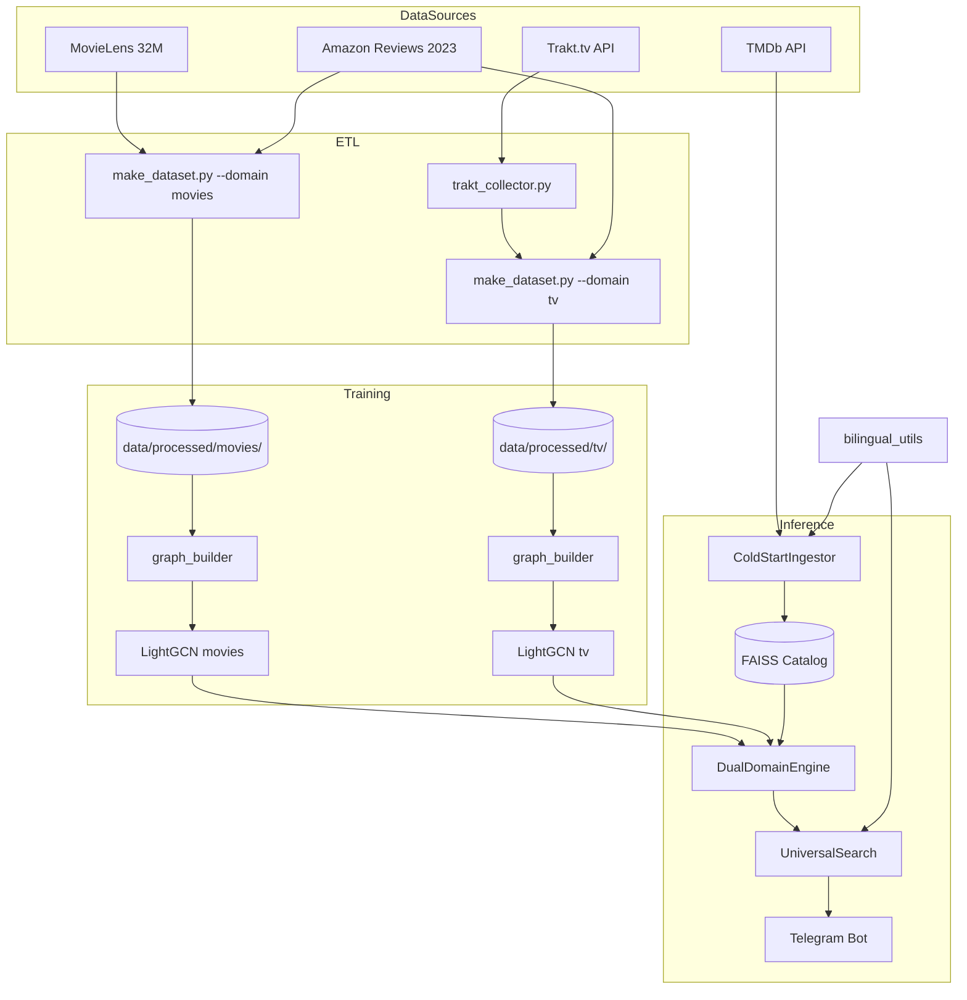

# PROJECT_SNAPSHOT: Dual-LightGCN Movie/TV Recommender

> **Timestamp:** 2026-05-29
> **Status:** Two-model architecture внедрена (Этапы 1–6 из `spec/two-model-architecture.md`); локальная тренировка реализована — CLI `trainer.py` + админский GUI `trainer_gui.py` (отрефакторен в подпакет `gui/`, см. 3.7). Этап 7 (retrain) — в работе (`spec/retrain-pipeline.md`).
> **Version:** 0.9.0

---

## 1. Vision & Core Concept

**Тип системы:** Гибридная dual-domain рекомендательная система реального времени с трёхъязычным интерфейсом (RU/UK/EN).

**Ключевая идея:** две независимые LightGCN-модели (фильмы и сериалы) со своими user/item-пространствами, объединённые через FAISS content-bridge на текстовых эмбеддингах. Это даёт качество внутри каждого домена + кросс-доменные рекомендации без размывания сигнала.

### Технологический стек
- **Core:** PyTorch, PyTorch Geometric (PyG)
- **Models:** Два LightGCN v2 (Hybrid: ID + Content Embeddings) — `models/movies/`, `models/tv/`
- **Content-bridge:** FAISS `IndexFlatIP` на нормализованных SBERT-векторах (`paraphrase-multilingual-MiniLM-L12-v2`)
- **Cold-start:** TMDb API + persistent SQLite HotCache + upsert в FAISS
- **Data:** MovieLens 32M + Amazon Reviews 2023 + Trakt.tv API + TMDb API
- **Search:** SBERT (semantic) + IDF (keywords/genres) + Title Normalizer
- **Interface:** Aiogram (Telegram Bot) с SQLite session-store

---

## 2. Архитектура (High-Level)

---

## 3. Модульная структура

### 3.1 Data Layer (ETL & Graph)
- **`make_dataset.py`** — два независимых билдера: `build_movie_dataset()` и `build_tv_dataset()`. CLI `--domain {movies,tv,all}`. Каждый домен имеет собственное user/item ID-пространство; `tmdb_id` остаётся глобальным ключом; для TV действует `TV_OFFSET=10_000_000`.
- **`trakt_collector.py`** — многофазный сборщик с SQLite checkpoint и token-bucket rate limiter (RATE_LIMIT_MAX=950 req/5min). Поддерживает resume через `--reset-phase`.
- **`graph_builder.py`** — `MovieGraphBuilder(dataset_dir=...)` строит разреженный двудольный граф per-domain.
- **`check_data.py`** — валидация целостности связей метаданных и индексов графа.

### 3.2 Model Layer
- **`lightgcn.py` (v2)** — гибридная архитектура: ID-эмбеддинги + Linear Encoder для жанров/года. BPR + InfoNCE loss. Edge Dropout 0.2, Xavier init с gain=1.5, no BatchNorm.
- **`trainer.py`** — `LightGCNTrainer` + полноценный CLI (`--domain`, `--data-dir`, `--output`, `--epochs` …) с metrics-sidecar и sanity-check. Исторически обучение шло на Google Colab.
- **`compute_embeddings.py`** — CLI `--domain {movies,tv} [--to-faiss]` для пересчёта SBERT-эмбеддингов и опциональной заливки в FAISS-каталог.
- **`faiss_bridge.py`** — `FaissCatalog` с `add()`/`search()`/`persist()`/`load()`. `IndexIDMap2(IndexFlatIP)` на L2-нормализованных эмбеддингах (cosine = dot product). Mapping `{faiss_id → (tmdb_id, media_type)}` в JSON-сайдкаре. Используется для cross-domain рекомендаций и cold-start.

### 3.3 Engine Layer (Search & Recs)
- **`dual_domain_engine.py`** — `DualDomainEngine` с двумя `UniversalSearchEngine` (movies + tv). Методы:
  - `recs_movie()` / `recs_tv()` — внутри домена через свою LightGCN
  - `recs_cross()` — чистый FAISS-bridge: по понравившемуся item возвращает противоположный media_type
  - `recs_all()` — объединение результатов с min-max нормализацией скоров
  - `_split_by_domain()` — роутинг по TV_OFFSET-конвенции
- **`universal_search.py`** — Media DNA (автоматическая разметка Anime/Gritty/Procedural), Intent Clustering (Agglomerative), HotCache (SQLite), TMDBLiveClient.
- **`cold_start.py`** — `ColdStartIngestor` для unknown items: TMDb fetch → HotCache upsert → SBERT encode → FAISS add. Идемпотентен (проверяет FAISS перед TMDb-вызовом). `_canonical_tmdb()` обрабатывает TV_OFFSET.

### 3.4 Bot Layer
- **`movie_bot.py`** (Aiogram) — основные команды:
  - `/start`, `/list` (с пагинацией), `/clear`
  - `/movies`, `/tv` — раздельные команды по доменам
  - `/trending` — 10 фильмов + 10 сериалов с `min_vote_count=100`
  - `/lang` — переключатель языка (RU/UK/EN)
- **Callback'и:** `recs_movie`, `recs_tv`, `recs_all`, `cross_movie`, `cross_tv`, `list_page`, `add_*`, `rm_*`, `sf_*` (поисковые фильтры).
- **Session store:** SQLite-таблицы `user_likes`, `user_prefs` (язык). Сохраняется между рестартами.
- **Async:** тяжёлые операции (рекомендации, поиск) через `asyncio.to_thread`.

### 3.5 Multilingual (RU / UK / EN)
- **`bilingual_utils.py`** — мультиязычные утилиты:
  - `GENRE_EN_TO_RU`, `GENRE_EN_TO_UK` — словари переводов жанров
  - `build_text_for_embedding()` — клеит title/overview/genres для SBERT
  - `_format_genres()` — учитывает `user_prefs.language`
- **TMDb translation cache** — отдельная SQLite-таблица. Поддерживает RU/UK/EN с per-user fallback (`requested_lang` → `en`).
- **Backfill scripts:** `scripts/backfill_uk_translations.py` (✅ выполнен), `scripts/backfill_ru_translations.py` (✅ выполнен — `title_ru`/`overview_ru` забэкфилены в production-parquet).
- **SBERT-модель:** `paraphrase-multilingual-MiniLM-L12-v2` — обрабатывает все три языка в одном векторном пространстве.

### 3.6 Admin Tools
- **`scripts/admin_users.py`** — CLI для аудита пользователей бота:
  - `--list` — все юзеры
  - `--user <id>` — лайки конкретного юзера
  - `--top <N>` — топ-N юзеров по числу лайков
- **SessionStore extensions:** `get_all_users()`, `get_user_likes()`, `get_top_liked(n)` (read-only).

### 3.7 Admin GUI (Flet)
Десктоп-GUI для админов/разработчиков (не end-user — для пользователей есть `movie_bot.py`). Запуск: `python -m recommendation_system.models.gnn.trainer_gui`. Подробный гайд — `docs/trainer_gui_guide.md`.

- **`trainer_gui.py`** — тонкая точка входа: реэкспортит `main`/`TrainerGuiApp` и держит `__main__`-блок (UTF-8 reconfigure stdout/stderr). Вся реализация вынесена в подпакет `gui/`.
- **`gui/`** — 4 вкладки + общий device-стейт, разбит на модули по слоям зависимостей (DAG, без циклов):
  - `theme.py` — общие константы (`COLORS`, `PROJECT_ROOT`)
  - `common.py` — кросс-табные утилиты: логгер-мост `_QueueLogHandler`, file-picker хелперы
  - `domain_stats.py` — `DomainStats` + коллекторы статистики датасетов/моделей (читают parquet-метаданные и sidecar JSON)
  - `training_tab.py` — вкладка «Обучение» (обёртка `trainer.main()` в фоновом потоке + live-метрики/чарт)
  - `dataset_tab.py` — вкладка «Создание датасета» (обёртка `MovieDatasetProcessor.build_*` + preset'ы + post-build sanity)
  - `inference_tab.py` — вкладка «Тестирование» (тот же `DualDomainEngine`, lazy-load движков, bilingual-поиск, 4 кнопки `/recs_*`)
  - `data_tab.py` — вкладка «Данные» (readonly дашборд per-domain)
  - `app.py` — `TrainerGuiApp` (layout, device-селектор) + `main()`
- **Что GUI делает:** локальная тренировка вместо Colab, сборка датасетов через UI, офлайн-тест рекомендаций, обзор состояния датасетов/моделей. **Не делает:** Trakt-collect, push в production, hyperparameter sweep, hot-swap моделей (нужен рестарт).

---

## 4. Логика интеграции данных

### 4.1 Amazon Reviews 2023
- Потоковый парсинг JSONL категории "Movies and TV"
- ID-маппинг через нормализованные `clean_title` (title_normalizer.py)
- 5-балльная шкала → бинарный позитивный сигнал (threshold 3.5+)
- `user_offset` для разделения user-id пространств MovieLens и Amazon

### 4.2 Trakt.tv (TV interactions)
- **Цель:** устранить дисбаланс movie/TV (исторически 99.4% / 0.6%)
- **Финальный сбор (2026-04-14):** **5020 шоу × 82987 юзеров (11775 private) × 1 949 437 рейтингов**, 39 041 API-запросов. ~2 суток wall-clock с checkpoint resume.
- **Фазы:** Discover shows → Enrich metadata → Network crawl (followers/following) → Collect ratings → Export CSV
- **ID Mapping:** Trakt TMDB IDs → unified `item_id` (через TV_OFFSET в `make_dataset.py`)

### 4.3 TMDb (cold-start + переводы)
- `TMDBLiveClient` дёргает API при cold-start
- Локальный SQLite-кэш переводов и метаданных
- Persistent upsert в FAISS — повторные запросы мгновенные

---

## 5. Методы стабилизации эмбеддингов
- **Structural:** Отказ от BatchNorm для сохранения дисперсии признаков
- **Contrastive:** InfoNCE с температурой 0.1 для разнесения векторов
- **Initialization:** Xavier Uniform с `gain=1.5`
- **Edge dropout:** 0.2

---

## 6. Кросс-платформенная идентификация
- **Primary ID:** TMDb ID (глобальный ключ для обоих доменов и FAISS)
- **Internal ID:** `item_id` (последовательный per-domain индекс для тензорных операций)
- **Media Offset:** `TV_OFFSET = 10_000_000` для tmdb_id сериалов в HotCache и FAISS-каталоге
- **Mapping:** `data/processed/{movies,tv}/id_mapping.json` — отдельный mapping per-domain

---

## 7. Текущее состояние моделей
- **`models/movies/lightgcn_movies_best_v4.pt`** — production-чекпоинт фильмов (обучен на Google Colab)
- **`models/tv/lightgcn_tv_best_v4.pt`** — production-чекпоинт сериалов (Google Colab)
- **`src/recommendation_system/faiss_index/catalog.faiss`** + `catalog_meta.json` — единый content-bridge для обоих доменов (~31 MB)
- **`models/lightgcn_best_v{3,4}.pt`** — старые unified-чекпоинты, оставлены для backward-compat / отладки
- **`models/archived_v1_3k_movies/`** — архив ранней версии

---

## 8. В работе (запланировано, не реализовано)

> ✅ **Завершено:** Локальная тренировка — `trainer.py` доведён до полноценного CLI (`--domain`, `--data-dir`, `--output`, `--epochs` …) с metrics-sidecar и sanity-check; `trainer_gui.py` (Flet) переписан под dual-domain (вкладки Обучение/Создание датасета/Тестирование/Данные на общем `DualDomainEngine`) и отрефакторен в подпакет `gui/` (см. 3.7).

### 8.1 Retrain Pipeline — `spec/retrain-pipeline.md`
**Цель:** `scripts/retrain.py` — оркестратор полного цикла (Trakt → make_dataset → trainer × 2 → embeddings → FAISS) с опциональными шагами (`--skip-trakt`, `--skip-raw`, `--skip-faiss`, `--domain`). Production-pointer `models/CURRENT.json`. Makefile-цели `retrain` / `retrain-quick` / `retrain-dry`. Запуск вручную раз в 1–3 месяца, без CI/cron.

---

*Generated for Deep Coding Session*
